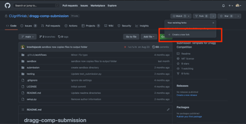

Conceptual Overview of DRAGG
============================

The GNOMES competition is built on the Distributed Resource AGGregator (DRAGG) simulation engine. DRAGG combines common household resources such as electric HVAC equipment (e.g. heat pumps), electric resistance water heaters, electric vehicles, photovoltaic (“PV”) generation, and home batteries to determine the aggregate load profile for a community of homes. For GNOMES you will only be responsible for the HVAC, water heater, and electric vehicle.

At each timestep environmental conditions such as outdoor air temperature (OAT), solar irradiance (GHI), and uncontrollable hot water use will impact the indoor air temperature and hot water tank temperature. Additionally the electric vehicle will be used throughout the day. Just as in a physical house, the virtual representation in DRAGG controls each of these resources to ensure the house is comfortable to the greatest degree possible: the HVAC will kick on when the house is too warm, and the water heater will turn on if the hot water goes cold. 

However, as described in “Welcome to GNOMES4Homes” some times of day are more convenient for running these appliances than others.

You can control your home's resources and get rewarded by the GNOMES utility for doing so! You may control your appliances in the following ways:

1.	The HVAC setpoints may be changed throughout the day. Please note that your HVAC is not guaranteed to respond to the change in setpoint because the temperature “floats” -- HVAC controls operate with a deadband to reduce the number of times the HVAC turns on and off. (“Cycling” behavior where the equipment turns on and off frequently can damage motors.) This is also why there is a minimum time duration for all your inputs. To ensure control of your HVAC that is reasonable, your setpoints will only be allowed to be between X and Y. 
2.	The water heater may be cycled on/off with direct control. Because electric resistance water heaters operate by running electric current through a conductor there is little risk to physical damage by cycling the water heater. To ensure safety your hot water must maintain a minimum temperature of X (to kill bacteria) and a maximum temperature of Y (to avoid scalding occupants).
3.	The electric vehicle charge is directly controllable at times when the electric vehicle is parked at home and not about to leave. The electric storage provided by the vehicle can offset some of the demand throughout the day to reduce peak loads.

Tutorial of Submission
4.	Getting Started
Download the submission template from the competition repository. It is important to set up the folder as a git repository, so follow these steps closely if you are unfamiliar with git.
1.	If you do not have a GitHub account, create one now. (https://github.com) 
2.	If you do not have it already, download git (https://git-scm.com/downloads) 
3.	From here “fork” the competition repository, located at https://github.com/CUgriffinlab/dragg-comp-submission. This will create a copy of the repository at https://github.com/YOUR-USERNAME/dragg-comp-submission.

4.	Copy the repository from GitHub to your computer using git clone:
$ git clone https://github.com/YOUR-USERNAME/dragg-comp-submission. 
	This will create a folder called dragg-comp-submission with all the files in the dragg-comp-submission repository
5.	Edit the submission file as described below and then commit/push them to your GitHub repository:
$ git commit submission/submission.py	-m “Custom message about improvement”
$ git push

6.	Creating your submission
For a complete submission you should customize the reward function to evaluate performance and the predict function to determine the action to take.

While the GNOMES competition will provide holistic feedback on your performance, the reward function can be useful to provide step-by-step feedback on performance. This is similar to how the machine learning algorithm “Reinforcement Learning” works: certain observations and actions can be categorized as “good” or “bad” via the reward observed and you can build intuition without exact knowledge.

The predict function is more directly related to the performance of the agent and provides the action to be performed at the next timestep. You are predicting the best action(s) to take. The output in three parts describes the action for:

1.	The HVAC setpoint
2.	The water heater on/off status
3.	The electric vehicle charge command

Once you change the submission/submission.py file no further changes need to be made. To be clear: you should only change the contents of submission.py; submission.py is the only file you are allowed to change and it is the only change that will be applicable to the competition performance.

4.	Testing your submission (locally)
To test your agent you can run the same simulation setup as the official competition on sandbox data. In real life you won’t be able to test performance on the real (future) weather data before deployment, you only have data from the past. Therefore the data we use to officially score you will be “new”, never seen before weather data (but with the same location and weather trends).

The steps to ensure the submission file is valid (i.e. no changes have been made that will break the submission):

1.	Clone the repository using $ git clone https://github.com/CUgriffinlab/dragg-comp-submission.git
2.	Change to the current working directory using $ cd dragg-comp-submission
3.	Install an editable version of your submission $ pip install --editable .
4.	Change into testing directory $ cd testing
5.	Run the tests $ python test_submission.py

The steps for self-evaluation are as follows:

5.	Download Docker (https://www.docker.com) which is a free software that allow you to replicate our setup easily. Docker will perform downloads and run the Python files in the order you need, without additional input.
6.	Install Docker as directed. The downloaded file (*.exe, *.mkg) should guide you.
7.	Check Docker is properly installed: go to your terminal or PowerShell and enter $ docker --version
8.	Change to the current working directory using $ cd dragg-comp-submission/sandbox
9.	Build the simulation using $ docker-compose build
10.	Run the simulation using $ docker-compose up --abort-on-container-exit

11.	Submitting and receiving official feedback

Your submission file must be updated and pushed to your repository in order to get official feedback. The official repository for the GNOMES competition will automatically evaluate all players’ submissions at 5AM Mountain Standard Time, if and only if their GitHub repositories are updated.